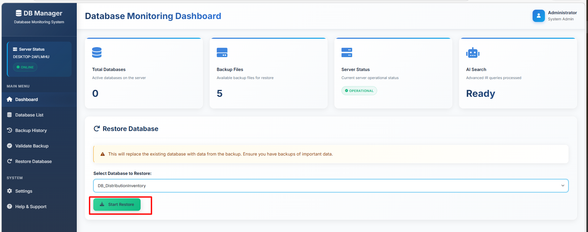
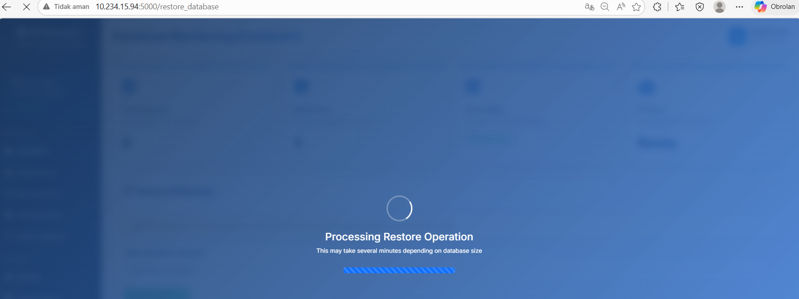

# Update README.md dengan script berikut
cat > README.md << 'EOF'
# SQL Server Restore Dashboard

##  Deskripsi
A powerful web dashboard to monitor, manage, and automate SQL Server database restore processes efficiently.

##  Tampilan Aplikasi

Berikut adalah screenshot lengkap dari aplikasi SQL Server Restore Dashboard:

---

### **1. Dashboard Utama**

---

### **2. List Database**

---

### **3. History Backup Database**

---

### **4. Header Only**

---

### **5. Select Database to Restore**

---

### **6. Restore Process**

---

### **7. Restore Running**

---

### **8. Result Restore**

---

